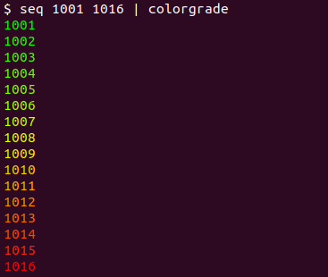

Conditional formatting for terminal
===================================

`colorgrade` utility colors output with a green-yellow-red gradient where green
corresponds to smaller values and red corresponds to greater ones. The idea is
similar to "conditional formatting" feature in spreadsheets. The numerical
values are picked from a single column in the input. The midpoint value is
colored yellow and can be set with `--mid` parameter.

A simple invocation `seq 1001 1016 | colorgrade` will produce the following
colored output:

Installation
------------
1. Clone the repo
2. pip install -r requirements.txt
3. pip install ,

Troubleshooting
---------------

You can verify that terminal displays colors accurately with `colorgrade_test`
utility included in the package. You should see a smooth green-yellow-red
gradient with no visible bands.
